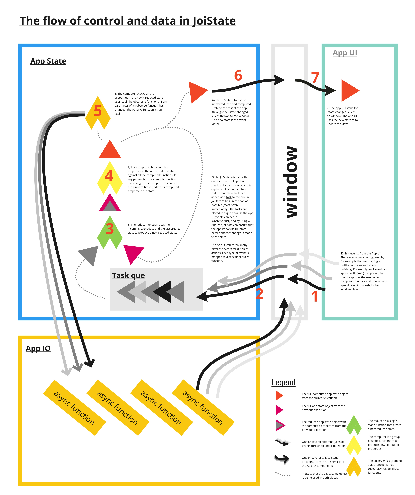

# JoiState
Small ES6 state manager. 
JoiState can both produce, reduce, compute and observe a state. 
The state consists only of a normal, immutable JS object.

## How does JoiState work?
JoiState works by:
a) gathering all state data into a consistent, single, immutable object, and
b) processing this state in 3 functional steps: reduce, compute, observe.

All the in-memory information of your app in a single object. This object is immutable, so that every time a child or a child of a child in an object changes, a new object for this change will be created efficiently. This is nice, it gives you the ability to simply dirtycheck to see if something has changed, and it gives you easy access to other features such as atomic changes and state change history.

When you want to change the state, you throw an event in the app and bind a reducer function to that event in the JoiState. When such an event is caught, the reducer function you have specified will take the previous state and the event detail of the event, and use this to change the state.

After the reducer have changed the state, all the compute functions bound to the JoiState will run one by one. The compute functions listens for certain paths in the state, and will only produce a new output value if one or more of its arguments have changed. The compute functions automatically produce a preprocessed view of other parts of the state, so that you don't have to do the same preparation of state objects in several different reducers or in several different parts of the app.

At last, the observers are run. Similar to the compute functions, the observers only run if the value of one or more of its observe functions have changed. The observers provide an excellent location to trigger async actions based on state changes, actions that should run in parallell with the normal update of the view.

## Why pursue JoiState?                                      
There are two types of apps: apps in a state of chaos, and apps with an ordered state. Now, of course, every app developer wants apps with an ordered state. And few developers make chaotic app states on purpose. Most app developer also follow some kind of strategy (backed by various libraries and authorative developer advocates) that they think will make their state ordered and safe. So why is the app state then a problem?

The problem with app state grows exponentially as the complexity of the app grows. First, the app becomes more quantatively complex. The app grows as ever more functionality and components are added. Second, the app becomes more advanced. It starts to handle asynchronous and parallell problems(state changes that in principle occur at the same time, but in different places). Third, the app becomes more technically advanced. It starts to spread across different platforms (client/server) and different technologies (html/css/js). And as all this complexity is piled on the app, the app state needs to be maintained with close to 100% precision. Yes, that is difficult.

So, how do we manage this complexity? Its mainly two ways: decentralized control or centralized control. The decentralized control we can call ObjectOrientation (OOP). Basically, OOP tackles the problem of state complexity by breaking the state into many smaller objects that in theory should be independent of each other. Centralized control I call single-state. (Some like to talk about it as functional. Redux is the big one here.) A single-state design moves all the "in-memory data", the "model", the "app user and db and other app information" into a single object at the heart of the app: the Single State with capitol S's.

I got to be honest with you. Its not such a long time ago since I myself made the switch from OOP to singlestate app structure. I had tried so hard to get the OOP structure to work. But every time I thought I had got it right, and I had to add just a little more functionality. And then the darn thing broke. And I had to start refactoring the app to fix it. And then one change here, led to another change there, and soon the refactor had cascaded from the state of one object to that of another, and back again, if I was truly lucky. After struggling with a decentralized state for a while, I made a choice. I am going to switch strategy! I am going to control the state of my app in one single location, and let all the other parts of my app just alert this StateManager about my changes. And so I too started designing apps with a Singlestate.

But why? Why did you do that? Why is a Single state architecture for your app better than an OOP architecture? Can you please say something more useful than just "that's my gut feeling" or "youtube told me so"? 

Well, I can try. When you have a big app, you can have units in different places of the app that can change the same part of the app. For example: You can have a log-in button in the UI and a db-connection in the background of the app that both need a UID. If you press the login-button, you might trigger a control function that will change the state of the UID, and then you have to alert both the login-button and the db-connection of the new state afterwards. Somewhere, somehow, you need a place of control that makes sure that the login-button and the db-connection both gets the latest UID. Now, if you use OOP, the idea here would be that one of the components, either the login-button or the db-connection, is principally responsible for UID. Or that they both share ownership. In any case, either the login-button must inform the db-connection, or db-connection inform the log-button if the UID changes. Or both. Ok, that works ok if you don't have many components involved in the transactions. But as the app grows, the state grows. More components needs to know about the UID. More components might change it. Many different bits and pieces of information gets stored around the Objects of the app, and you, the developer of the app, looses oversight. You start forgetting. One week you work with UI, and you make the login-button the owner of UID. Next week you work with the db-connection, and then you move the UID control back there. Come next month, you have control of userName in the login-button and control of UID in the db-connection. Of(f) course you are.

But, the problem doesn't stop there. You are also coding async. You don't lock the UI controls while the db-connection loads data. No can do. So now the login-button can be pressed, many times, while the db-connection is still trying to load the user data. So, you must start making logic for handling the situation "waiting to load user data" in the login-button and "trying to log in while previous log in is still processed" in the db-connection. For all your async problems. In all your objects that are affected.

And so, to tackle the problem that different parts of your app needs to read and change the same part of the overall app state, and that these actions can happen in parallell, you try to make some centralized, "controller" structures in your app. To handle the most difficult pieces of your app state. And then you end up with a right proper mess. Some central entities that control some more problematic aspects of your apps state, while other critical tidbits of information is spread around your app like hidden diamants dropped in snow.

So, naturally, what if we instead of trying to manage the complexity of the state by splitting it up, put all state data together in one place? Centralize everything? It turns out, that if we centralize our app data that first, we get much better oversight over when and what changes that alters the app and in what way. All our app data is stored in one object, and when the app does something, we can see what changes in this single app state object. That is nice. That helps. With the first problem of OOP state at least. The second problem with the same state being changed in several parallell threads of time, can be solved with a que now that you have a single place where all these parallell threads coalesce. The only problem is that it nullifies parts of my precious education where I got diplomas that says that OOP is the best way to code.

TLDR; Gathering all the app data in a single app state has few mayor drawbacks. On the plus side it adds a great deal of oversight. And it gives you a place to put your que if you need to tackle async state changes. And if you add the principle of immutability in your state object, you get some other cool features such as timetravel and atomic operations. That helps us sleep.

###Problem with mutability occurs when
a) big, distributed, many different files all working against the same data

b) async, different parts of app need to wait for other parts of app to both write to the same properties.

### In depth descriptions
1) [How to structure web components 1 (OOP and functional?)](./tutorial/web_comp.md)
2) I should have one about how to structure the routing in the web components