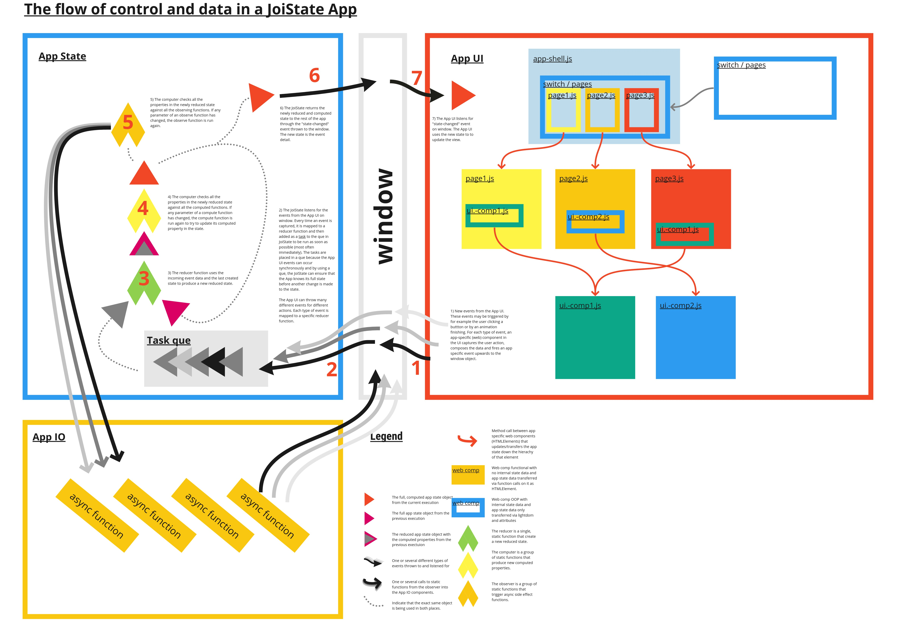

## How to manage state in web components
Web components is a modular technique that support and encourage OOP architecture. 
But it is also both possible and simple to make web components that are functional.
The Questions become: which strategy to choose, where and why? 
When and why should you make an OOP web component with internal state?
And when and why should you make functional web components?

### Strategy 1: App-specific web compoments.
An **app-specific** web component contains functionality and template custom to one
specific app. When you make such an app-specific web component, you can and should place 
the template in the shadowRoot. The shadowRoot encapsulate your styles so that you can 
modularize the styles of your app in different bits and pieces. The shadowRoot is also 
easier to access and change from the js code in your component.

When you are making an app specific element, you are in control of how and when the web 
component is called. This makes it much simpler to control the architecture of the 
component, and you should choose a functional approach. You make a web component 
functional by "refreshing everything" when new state data comes into the component.
By using a "smart" framework such as hyperHTML or Polymer, you can ensure that the 
component reuses as much of the actual DOM when it refreshes its view. 

### Strategy 2: Generic web compoments.
A **generic** web component has a general purpose so that you plan to use it in 
many different apps. When you make a **generic** web component, it is better to place 
the content in the component in the lightDOM and/or attributes of the component.
These components function as either leave nodes or wrapper elements in the DOM.

When you make a generic element, you might have some situations in which you are 
well served by storing the state of user interaction, animation sequence, previous 
network status etc. directly in the component. You want internal state in the 
component. Here are some criteria that you should check for in such cases:
1) The data stored is generic, ie. *not* app-specific. You feel strongly that none 
of the other components needs to know about this state data neither now or in the 
future. Generic state data and its web components are more your extension of the HTML
platform. Examples of generic state data can be:
   * Data purely concerning the view of **one single element**. There is only one 
   single element that both produce and consume this piece of data.
   * The data is fairly **isolated**. The element does not need to mix data from 
   several outside sources to produce this data.
   * UI smartness such as remembering previous searches in a search form.
   * platform extension such as tracking the network status and making a history of
   that data.  

2) The component is used *only* in the template of other components. This means
that you can and must send all app-specific data relevant for this component as either
primitives in attributes or as other HTML elements in the lightDOM of the component.

If the criteria above fits, sparse(!) use of internal state (OOP) can be beneficial.
The problem with the functional approach is that any state data you want to add to the
global state, requires a) a reducer function to be set up, b) a branch or property added
to the global state object, and c) passing that property down in the UI to the component 
that needs it. If *no* other component needs to know about this data exccept from the 
component that makes it and uses it, then this *can be* redundant boilerplate. 

Using the OOP strategy in this case enables the programmer to store the state data 
inside the component so that none of the other components need to know about it. 
Even for the simplest data, this strategy has its pitfalls. But OOP here will make 
*reuse* of the component much simpler. The component can then be dropped into the
template of other code and no other integration activity will be needed. Therefore,
used sparsely and only on generic elements that both are solely responsible for 
producing and consuming a piece of fairly isolated data, OOP can be preferable.